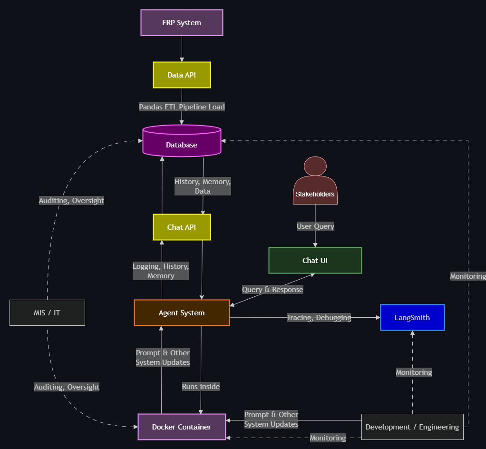
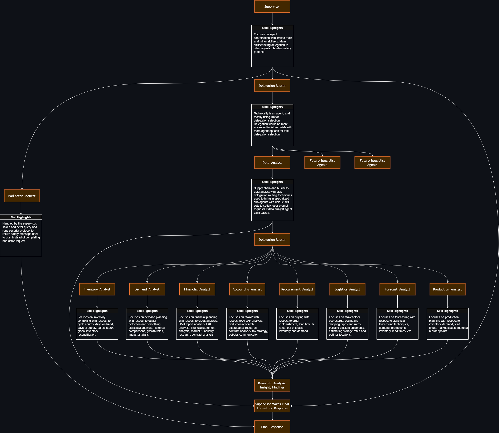

# Multi_Agent_System_Data_Analyst_Enterprise_Build
Multi Agent System Data Analyst build with enterprise grade security.

**Note: This repo is being continually updated. Project source code is not uploaded at this time.**

## Analysis Tools
Database tools that operate on PostgreSQL data:
- Inventory summary
- Highest on hand items
- Low stock detection
- Demand versus on hand comparison
- Overdue order identification
- Demand spike detection

## Security Notes
- Passwords are stored as bcrypt hashes.
- API routes are protected with an API key.
- Rate limiting is applied to selected endpoints.
- Security headers are attached in middleware.
- Role checks gate admin UI access.
- File access is constrained through path validation helpers.

## Operational Status
Implemented:
- Authenticated multi-user access
- Role model for admin and standard users
- Persistent threads
- Database-backed inventory analysis
- Dockerized API deployment

## Enterprise Deployment
This project is designed so end users never run the stack on their own machines. They open a browser to an internal URL. Streamlit, the FastAPI service, and PostgreSQL run on company infrastructure.

### How employees would use it
1. Connect to the corporate network or VPN.
2. Open an internal hostname such as `https://app.company.com`.
3. Sign in with an assigned account (or company SSO).
4. Work in the UI. The browser talks only to Streamlit. Streamlit calls the API. The API is the only service that reaches PostgreSQL and the model provider.

No Docker, Python, or database client is required on the employee laptop.

### Where it would run
The same Docker Compose services used locally would run on one of:
- A Linux virtual machine managed by IT, reached with SSH for operations
- A container platform (ECS, Azure Container Apps, OpenShift, Kubernetes)
- An internal app host with a reverse proxy terminating HTTPS

A VM is common for these deployments, but it is not required.
PostgreSQL would stay on a private network. Only the API container would be allowed to connect to it. Port 5432 would not be published to the build or the internet.

### Network path
```
| From | To | Notes |
| --- | --- | --- |
| Employee browser | HTTPS reverse proxy | VPN or office network |
| Reverse proxy | Streamlit | User interface |
| Reverse proxy | FastAPI | API |
| Streamlit | FastAPI | Chat and admin calls |
| FastAPI | PostgreSQL | Private network only |
| FastAPI | Model provider | Outbound HTTPS only |
```

Streamlit `API_URL` would be the internal API hostname, not `localhost`. The API database URL would be the internal Postgres hostname, not `host.docker.internal`. Secrets (API keys, database password, model keys) would be injected as environment variables from a vault. They would not live in the repository.

### Access control
The current application separates `business_admin` and `business_user`. More roles may be configured with full or limited access (external stakeholder access etc).
In a production company environment this login table would be replaced or fronted by SSO (Entra ID, Okta, or Active Directory). Group membership would map to the same two roles. Admin routes would remain blocked for standard users.

### Operations
Operator tasks on VM:
- `docker compose ps`
- `docker compose logs -f api`
- `docker compose up -d`

Preferred long term pattern: CI builds images on git push and CD restarts the services. Employees keep using the same URL. They never receive a copy of the project to run locally.

## License
Proprietary. Internal use only unless otherwise specified by the project owner.

## User Interface and Application Showcase
→ [View Project](https://github.com/AutomationPlease/Multi_Agent_System_Data_Analyst_Enterprise_Build/tree/main/streamlit_app_showcase)

## Architecture

System architecture design diagram for the enterprise build:



Some future development path considerations:
##


##

