# Home Page

### Home page, blank chat displayed with side panel hidden
  - Chat Statistics show total message count (User Questions + Agent Responses) to help user identify when chat is becoming to lengthy and needing to start new chat (showing 0's because blank conversation)
  - Conversation timeline which shows the user prompts, and if clicked will open up to give the agent responses to that prompt (not showing anything because blank conversation).
  - Under the conversation timeline is a export chat function to export the full chat into the file type of choice (this will only appear once conversation begins).

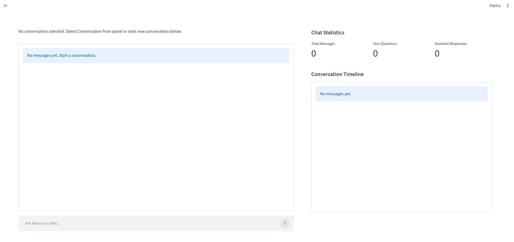

### Home page, blank chat displayed with side panel showing
  - Shows User Name, User Role, Services Status.
  - Logout, self explanatory.
  - Dashboard, goes to analytical dashboards page for given data sets in system.
  - Best Practices, goes to page to help train user with guidance around how to use chat, how to interact with agents, and other tips/tricks/techniques to improve user session effectiveness.
  - Data Tables, goes to page to view tables for data in system.
  - Admin, only visible to users with admin role, goes to admin page for system and user governance.
  - New Chat, starts blank new chat.
  - The home page side panel may be hidden by the user by clicking the double arrow in the top left corner of the screen at the top of the home page.
    - The side panel is only visible to users while on the home page. If user is within any other page then they will only have a Return to Home button where the double arrow button would normally be.

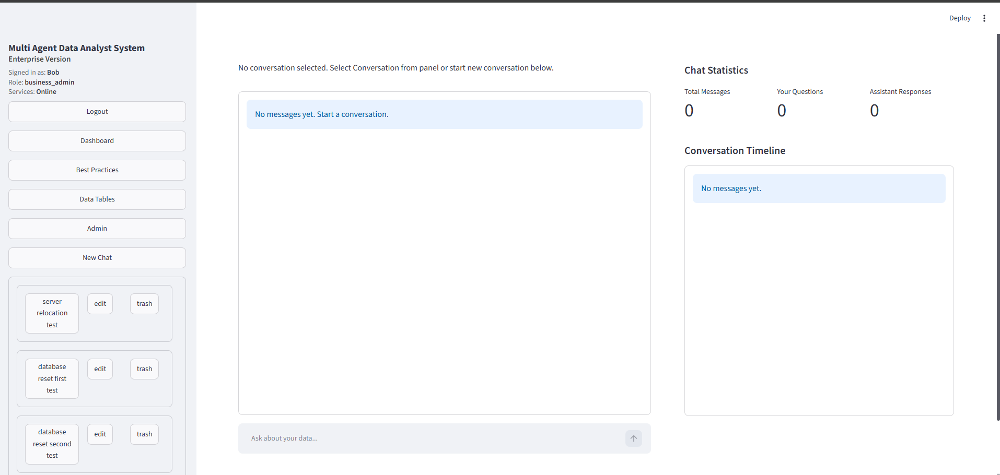

  - Panel Sizes, can be adjusted by the user or reset back to normal.
    - These adjustments can only be made to the chat box, and conversation timeline.

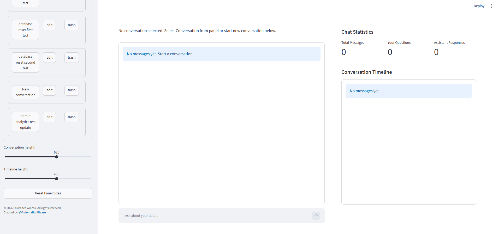

  - As a user creates more and more chats they will each be adding to the conversations container starting below the New Chat button, and will be sorted in Descending order, so newest to oldest.
    - New chats get added as "new conversation". The user has the ability to edit the chat name, or delete the chat. As the users performs these interactions the API endpoint will simultaneously update the respective data tables for these changes in Postgres.
    - There is no limit to the number of chats a user may have stored (active or not). The conversations container has a separate scroll bar that would allow a user to pick out a specific chat for review, analysis or continuation of previous session.

<table>
  <tr>
    <td width="50%" valign="top" align="left">
      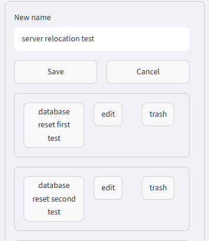
       Showing conversation rename
    </td>
    <td width="50%" valign="bottom" align="left">
      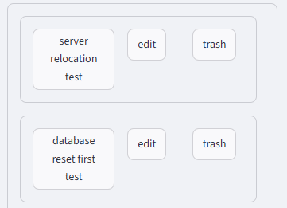
       Showing conversation deleted
    </td>
  </tr>
</table>

# Admin Page

- Admin page button is only visible to users with admin role.
- It is filled with user and system metrics that would help audit, report, and govern the users as well as the system overall.
- I tried to cover all of the most useful metrics I thought an organization would want to track or monitor.
  - More metrics for monitoring and tracking may be configured through API endpoints within the streamlit_app.py and api.py files.
- The first below screenshot is showing what the user see's when entering the admin page.

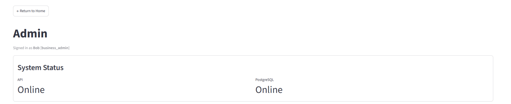

- Usage is showing different user metrics to track and monitor various costs, token spend, etc.
  - More metrics may be added for tracking and monitoring purposes but would need have the API endpoints configured in both streamlit_app.py and api.py files.
 
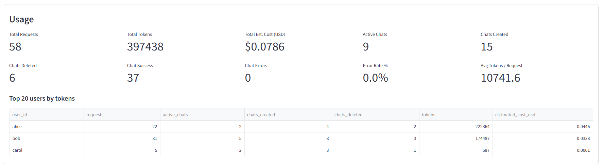

- Recent activity is showing user most recent activity.
  - conversation activity such as renaming and deleting will still appear under this recent activity feed.

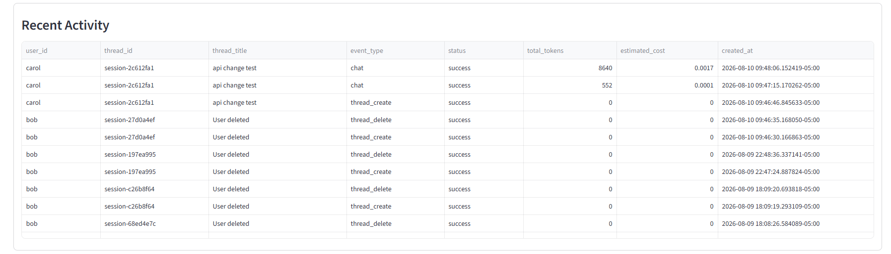

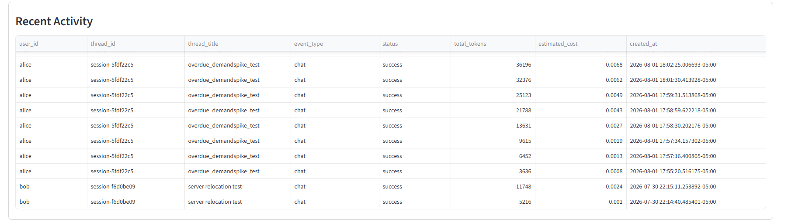

- Data is showing the number of manual external dataset SQL imports into Postgres that have been completed. The number of external data files within the Data folder. The number of database tables the agents have access to in Postgres.
  - Recent imports gives a snippet of the recent SQL imports into Postgres. The limit on this feed is to only show last 20 imports, but this can be reconfigured like all of the other endpoints can be.
  - Data Folder Files and Database Tables are just showing you the current datasets that the agents have access to. Due note that the Data Folder is really only being used as a placeholder for automating SQL imports of external datasets that may not have access to have an API endpoint configured for. So as long as you can get a dataset to be loaded, then this folder and the script in the other project files may be used for data pipelines into Postgres.

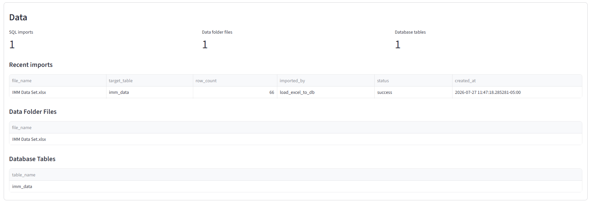

- Governance is helping admins identify user chat errors (no errors shown here so display says no failed chats. if error occured it would list user_id, thread_id, title, timestamp, error message as a table sorted in descending order).
  - Also helping admins do system cleanup to help get rid of blank/lost/inactive chats left over by users.

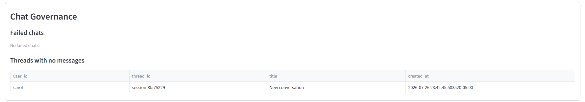

- Users is giving full list of all users that have accounts in the system and the information that is respective to that user.
  - More data can be tracked/monitored but would need to have the endpoints configured in streamlit_app.py and api.py files.

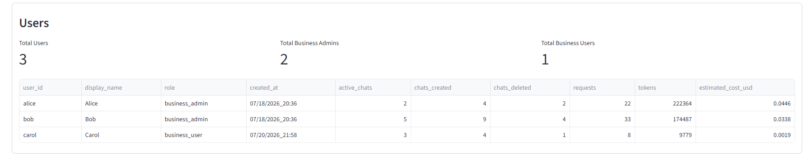

- Admin charts are different from visuals that would be found on the dashboard page.
  - These are more for usage, user, and system tracking/monitoring rather than data visualization.
  - Just as before, more visuals for tracking/monitoring these metrics may be added, but needs the endpoint configurations done within streamlit_app.py and api.py files.
  - And to note that I just did a full database reset for system testing purposes at the time of writing this markdown, so the metrics being tracked visually in the screenshots below don't show a long history, but you can still get a perspective into how they function.

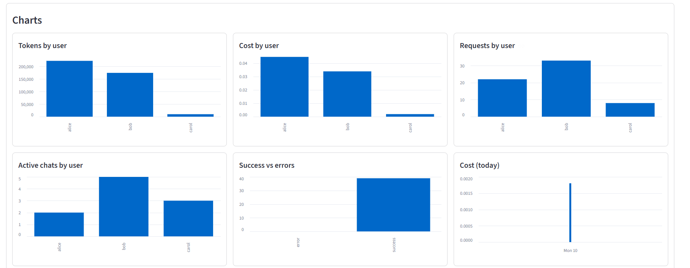

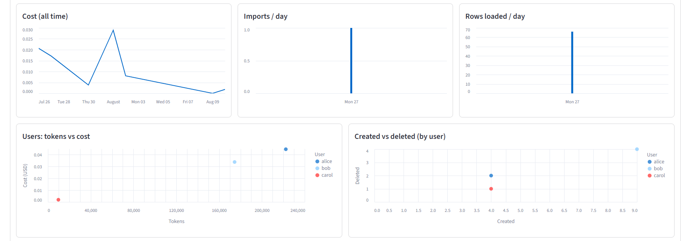

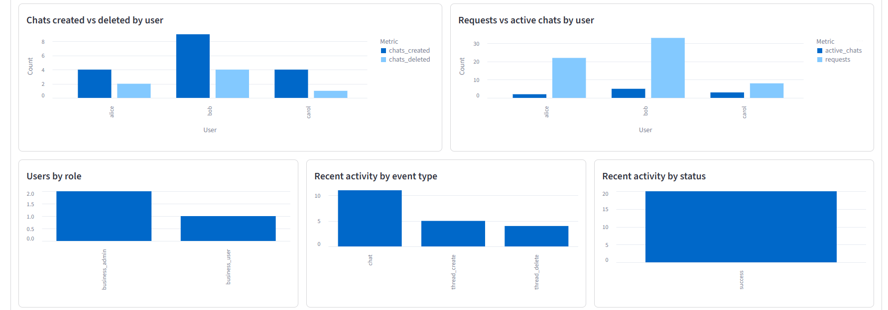

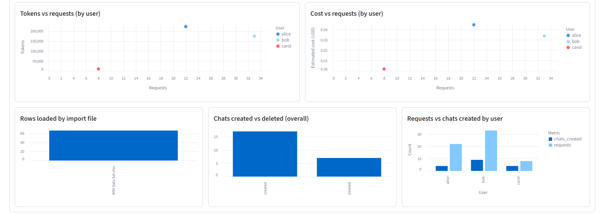

# Best Practices

- Best Practices is a helpful page given access to all user roles for helping with tips, tricks, techniques, SOPs for how to best utilize the agent system.

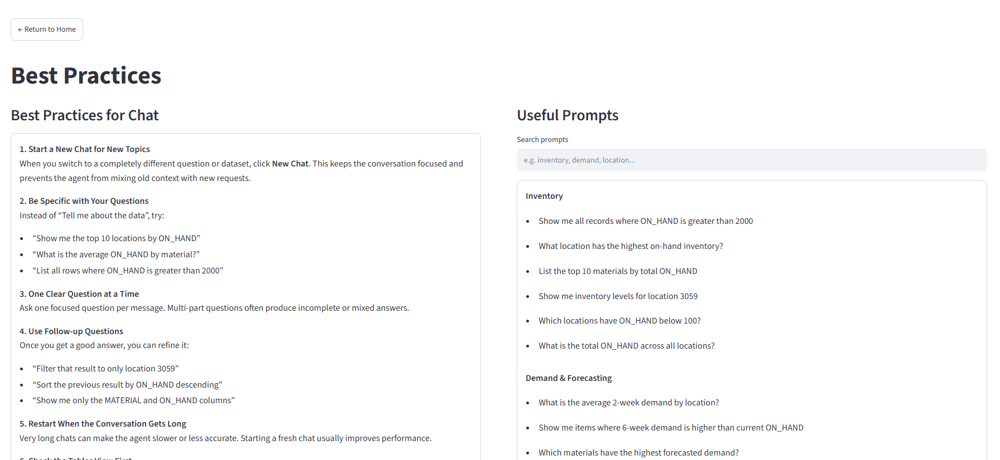

---
**More demonstration and further explanation will be added in the future. Adding to and expanding on these as I go.*
